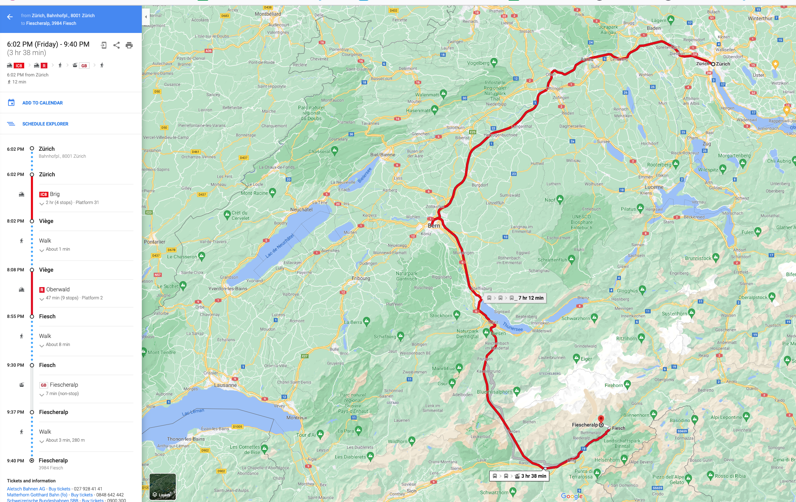

Aletsch 2021 trip
=================

Hello all and welcome to the Aletsch 2021 trip.

Details
-------

**Dates:** Saturday, July 24th - Sunday, July 25th.

**Hotel:** [Hotel Alpina](https://www.alpinafiescheralp.ch/), Fiesheralp.

Accommodation is confirmed for Saturday night for Justin, George, Dara and Henrik - no further action is needed.

**Travel:** see below for details and price.

Fiescheralp
-----------

Some of us have been to Fiescheralp before during the ski season. It's a little unsual in being a ski village that's actually on the mountain proper (which makes it great for parents who don't want to have to get screaming children up the mountain each morning - they can just kick them out the door instead).

The train brings us into Fiesch (bottom right), then we take a cable car up to Fiescheralp. There's actually a substantial mountrain range between us and the Aletsch glacier but this is essentially as close as one gets other than walking.

You can find the above map in interactive form [here](https://s.geo.admin.ch/91e9e06b89) on the Swisstopo site.

To get to the Aletsch glacier, one either walks North-East around the base of T&auml;lligrat (see the trail marked Geissbode and Unners T&auml;lli) and then past the M&auml;rjelen-Stausee and the M&auml;rjelenseen. Or one walks South-West from Fiescheralp and around the South-West base of the Bettmerhorn.

While there are cable cars up from Fiescheralp to the peaks, there's no way down on the other side (other than falling to your death). But there is a tunnel at the Western tip of the M&auml;rjelen-Stausee - we'll come to that below.

Journey there
-------------

Leaving on the 7:02 IC8 (platform 31) from the HB, we then change at Brig, continue to Fiesch and then take the cable car up to Fiescheralp.

You can find the above journey details [here](https://goo.gl/maps/MJL9upWCdWRqRH6a7) on Google maps.

With a Halbtax, the best price for a return ticket is two Saver Day Passes that cost Fr. 54 each, i.e. **Fr. 108** in total.

Proposed first walk
-------------------

I'm proposing this for our walk on Saturday. We set out from Fiescheralp (A) continue up around the T&auml;lligrat and past the lakes to B. Then we backtrack to C and return via the [Tälligrattunnel](https://de.wikipedia.org/wiki/T%C3%A4lligrattunnel). We then continue to D and turn up to the Eggishorn for a well earned drink at the Horli-Hitta and then take the cable car down to Fiescheralp. The bit between D and E is the only significant climb and we can decide ourselves at that point if we want to bail and return in shame downhill to Fiescheralp or climb on like champions to Eggishorn.

**Update:** it seems we're saved from this uphill part - I rang the Aletsch Arena tourist office and it turns out Eggishorn and the routes out from there, along the mountain ridges to Bettmerhorn and along the T&auml;lligrat (and down to the M&auml;rjelen-Stausee), are closed due to the volume of snow that's fallen!

If you're wondering about the part of the route marked in yellow and the part marked in red and white - the red and white bit is no longer accessible (due to rock slides) and the yellow marked bit is the alternative.

You can find the all the area's hiking routes marked [here](https://map.schweizmobil.ch/?lang=en&land=wanderland&etappe=39.02&photos=yes&bgLayer=pk&logo=yes&season=summer&resolution=4.68&E=2647713&N=1139977&layers=Wanderland) on the SchweizMobil site.

### Walking along the glacier

You may be wondering why I'm not proposing walking along the glacier itself, i.e. the route marked in green above. To do this, you have to do the walk I'm proposing to point B (or take the cable car up to Eggishorn and walk down from there to the M&auml;rjelen-Stausee) and then walk along the glacier before turning around the South-West end of Bettmerhorn and from there back to Fiescheralp. To be honest, I think this is unfortunately beyond our ability and there are no options for bailing out once you're beyond point B.

But we can see how we feel on Sunday!

Sunday walk
-----------

The above walk is one I pieced together from the marked routes on SchweizMobil and suggestions on the web. I'm not proposing anything for Sunday - we can see how we feel when we're there.

However, the best site I found for complete suggested routes is the tourist site for Aletsch Arena area (which includes Fiescheralp). You can find their suggested walks [here](https://www.aletscharena.ch/en/activities/walking#cat=Hiking-main,Hiking%20Trail,Nature%20Trail&filter=r-fullyTranslatedLangus-,r-onlyOpened-undefined,sb-sortedBy-0&zc=14,8.10436,46.42874). Just scroll down to the "Walking Suggestions" section. As often seems to be the case with such sites, the interactive map looks great but is rather fiddly to work with (and impossible on a mobile phone or tablet).

As noted above, parts of these routes (the bits that involve Eggishorn or the mountain ridges) are closed due to the volume of snow.

That's it - if you've read to here, I'm proud of you. Look forward to seeing you all there.
